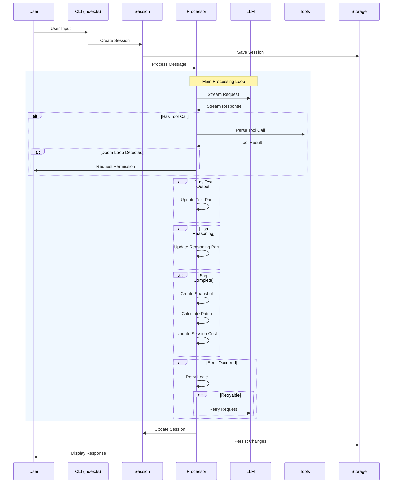
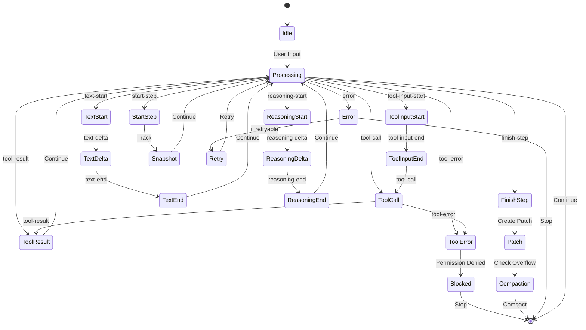
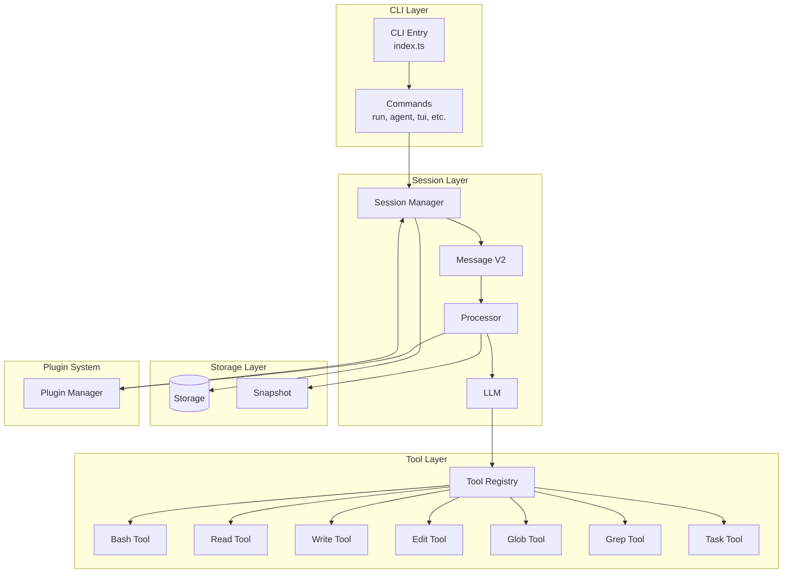

# Agent Process Flow

## Sequence Diagram

```mermaid
sequenceDiagram
    participant U as User
    participant CLI as CLI (index.ts)
    participant S as Session
    participant P as Processor
    participant LLM as LLM
    participant T as Tools
    participant DB as Storage

    U->>CLI: User Input
    CLI->>S: Create Session
    S->>DB: Save Session
    S->>P: Process Message

    rect rgb(240, 248, 255)
        Note over P,LLM: Main Processing Loop
        P->>LLM: Stream Request
        LLM->>P: Stream Response

        alt Has Tool Call
            P->>T: Parse Tool Call
            T->>P: Tool Result
            
            alt Doom Loop Detected
                P->>U: Request Permission
            end
        end

        alt Has Text Output
            P->>P: Update Text Part
        end

        alt Has Reasoning
            P->>P: Update Reasoning Part
        end

        alt Step Complete
            P->>P: Create Snapshot
            P->>P: Calculate Patch
            P->>P: Update Session Cost
        end

        alt Error Occurred
            P->>P: Retry Logic
            alt Retryable
                P->>LLM: Retry Request
            end
        end
    end

    P->>S: Update Session
    S->>DB: Persist Changes
    S-->>U: Display Response
```

## State Machine

```mermaid
stateDiagram-v2
    [*] --> Idle
    Idle --> Processing: User Input
    Processing --> TextStart: text-start
    Processing --> ReasoningStart: reasoning-start
    Processing --> ToolInputStart: tool-input-start
    Processing --> ToolCall: tool-call
    Processing --> ToolResult: tool-result
    Processing --> ToolError: tool-error
    Processing --> StartStep: start-step
    Processing --> FinishStep: finish-step
    Processing --> Error: error

    TextStart --> TextDelta: text-delta
    TextDelta --> TextEnd: text-end
    TextEnd --> Processing: Continue

    ReasoningStart --> ReasoningDelta: reasoning-delta
    ReasoningDelta --> ReasoningEnd: reasoning-end
    ReasoningEnd --> Processing: Continue

    ToolInputStart --> ToolInputEnd: tool-input-end
    ToolInputEnd --> ToolCall: tool-call
    ToolCall --> ToolResult: tool-result
    ToolCall --> ToolError: tool-error
    ToolResult --> Processing: Continue
    ToolError --> Blocked: Permission Denied
    Blocked --> [*]: Stop

    StartStep --> Snapshot: Track
    Snapshot --> Processing: Continue

    FinishStep --> Patch: Create Patch
    Patch --> Compaction: Check Overflow
    Compaction --> [*]: Compact

    Error --> Retry: if retryable
    Retry --> Processing: Retry
    Error --> [*]: Stop

    Processing --> [*]: Continue
```

## Component Architecture

```mermaid
flowchart TB
    subgraph CLI["CLI Layer"]
        C[CLI Entry<br/>index.ts]
        CMDS[Commands<br/>run, agent, tui, etc.]
    end

    subgraph Session["Session Layer"]
        S[Session Manager]
        M[Message V2]
        P[Processor]
        L[LLM]
    end

    subgraph Tools["Tool Layer"]
        TB[Tool Registry]
        B[Bash Tool]
        R[Read Tool]
        W[Write Tool]
        E[Edit Tool]
        G[Glob Tool]
        GR[Grep Tool]
        TS[Task Tool]
    end

    subgraph Storage["Storage Layer"]
        DB[(Storage)]
        SS[Snapshot]
    end

    subgraph Plugin["Plugin System"]
        PL[Plugin Manager]
    end

    C --> CMDS
    CMDS --> S
    S --> M
    M --> P
    P --> L
    L --> TB
    TB --> B
    TB --> R
    TB --> W
    TB --> E
    TB --> G
    TB --> GR
    TB --> TS
    S --> DB
    P --> SS
    P --> PL
    PL --> S
```
